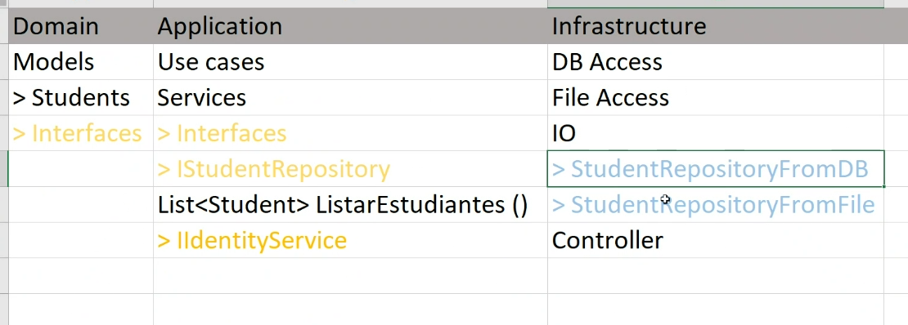
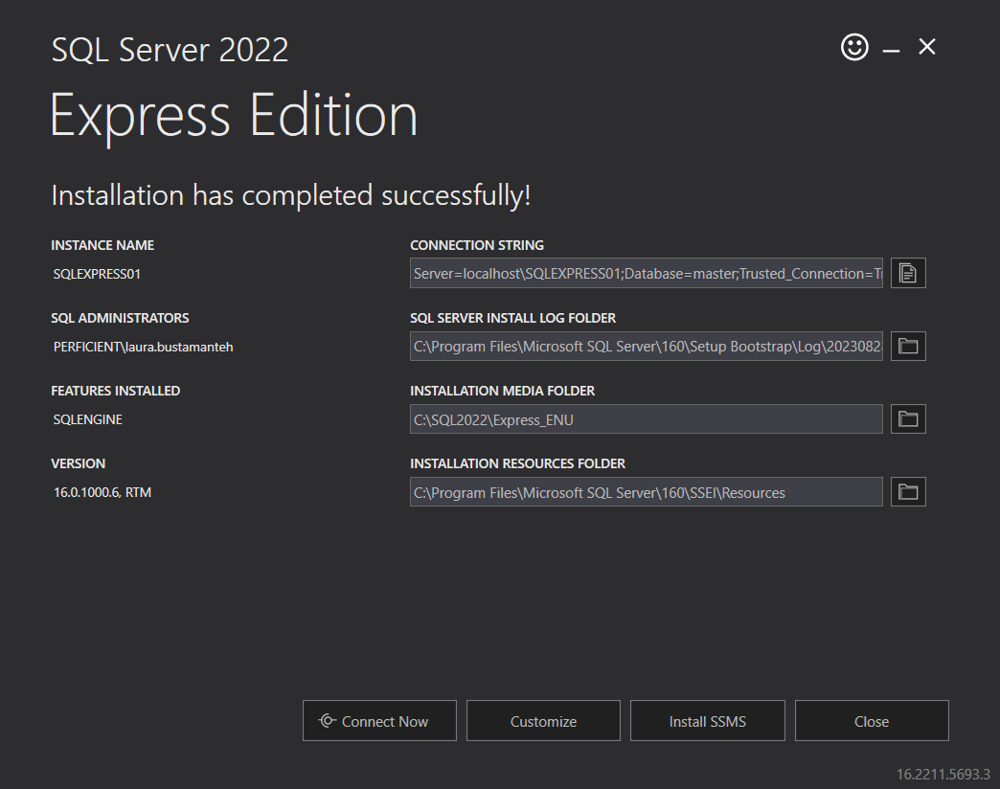
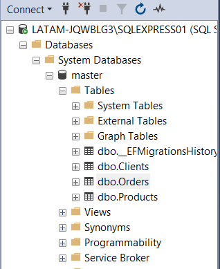

 # Week 1

 ## [Notification pattern](https://martinfowler.com/articles/replaceThrowWithNotification.html)

 A notification is an object that collects errors, each validation failure adds an error to the notification. A validation method returns a notification, which you can then interrogate to get more information. A simple usage looks has code like this for the checks.

    private void validateNumberOfSeats(Notification note) {
        if (numberOfSeats < 1) note.addError("number of seats must be positive");
        // more checks like this
    }

We can then have a simple call such as aNotification.hasErrors() to react if there are any errors. Other methods on the notification can drill into more details about the errors.


I need to stress here, that I'm not advocating getting rid of exceptions throughout your code base. Exceptions are a very useful technique for handling exceptional behavior and getting it away from the main flow of logic. This refactoring is a good one to use only when the outcome signaled by the exception isn't really exceptional, and thus should be handled through the main logic of the program. 

### Building a Notification
In order to use a notification, you have to create the notification object. A notification can be really simple, sometimes just a list of strings will do the trick.

A Notification collects together errors

    List<String> notification = new ArrayList<>();
    if (numberOfSeats < 5) notification.add("number of seats too small");
    // do some more checks

    // then later…
    if ( ! notification.isEmpty()) // handle the error condition

Although a simple list idiom makes a lightweight implementation of the pattern, I usually like to do a bit more than this, creating a simple class instead.

    public class Notification {
        private List<String> errors = new ArrayList<>();

        public void addError(String message) { errors.add(message); }
        public boolean hasErrors() {
            return ! errors.isEmpty();
        }
        …

By using a real class, I can make my intention clearer - the reader doesn't have to perform the mental map between the idiom and its full meaning.

## Create a method to validate an input:

(For those of you who already have .NET Core experience, please use the new C# 9 instructions for simplified methods -Top Level Statement-)

Input Parameters: A string that stores an id.

Output parameters: A list with the validation problems. If the id is correct, return an empty list.

**Rules:**

* A valid ID must have a minimum of 5 characters, a maximum of 32.
* A valid ID must start with a capital letter: A-Z
* Implement the method in 3 different ways:

**Method 1:** Regular Expressions
**Method 2:** If normals.
**Method 3:** Throwing exceptions when some condition is not met.

* Create cycles of 1,000,000 interactions with each method.
* Within the loop, call the evaluated method 4 times: With a string without problem, with a string that does not meet the minimum length, with a string that does not meet the maximum length, with a string that does not meet the initial capitalization rule.
* Measure total execution time.
* Measure average and total processor and memory consumption by each method (System.Diagnostics) https://ourcodeworld.com/articles/read/1121/how-to-retrieve-the-amount-of-memory-used-within-your-own-c-sharp-winforms-application
* Show the execution times and memory/processor information of each method in console.

        using System;
        using System.Diagnostics;
        using System.Text.RegularExpressions;

        // method that validates an input with ifs
        // Input Parameters: A string that stores an id.
        // Output parameters: A list with the validation problems. If the id is correct, return an empty list.
        List<string> validateInput(string id)
        {
            // string to store the validation errors
            var errors = new List<string>();

            if (id == null || id.Length == 0) 
            {
                errors.Add("Id can not be empty");
                return errors;
            }

            if (id.Length < 5 || id.Length > 32)
                errors.Add("Id must have a length between 5 and 32 characters");

            if (!char.IsUpper(id, 0))
                errors.Add("Id must start with a capital letter between A and Z");

            return errors;
        } 

        // method that validates an input with regular expressions
        // https://learn.microsoft.com/en-us/dotnet/standard/base-types/regular-expression-language-quick-reference
        List<string> validateInputRegex(string id)
        {
            // string to store the validation errors
            var errors = new List<string>();

            if (id == null || id.Length == 0) 
            {
                errors.Add("Id can not be empty");
                return errors;
            }

            if (id.Length < 5 || id.Length > 32)
                errors.Add("Id must have a length between 5 and 32 characters");

            if (!Regex.Matches(id, "^[A-Z]+", RegexOptions.IgnorePatternWhitespace).Any())
                errors.Add("Id must start with a capital letter between A and Z");

            return errors;
        } 

        // method that validates an input with Throwing exceptions 
        // exceptions: https://www.tutorialsteacher.com/csharp/csharp-exception
        void validateInputException(string id)
        {
            if (id == null || id.Length == 0) 
            {
                throw new ArgumentNullException("Id can not be empty");
            }

            if (id.Length < 5 || id.Length > 32)
                throw new ArgumentException("Id must have a length between 5 and 32 characters");

            if (!char.IsUpper(id, 0))
                throw new ArgumentException("Id must start with a capital letter between A and Z");

        }

        // strings to test
        var stringsToTest = new List<string>{ "A123456789", "D542", "FREGTHY547896321458934789fgtredjuyh", "fgurhty855", "", "547"};

        // https://stackoverflow.com/questions/4679962/what-is-the-correct-performance-counter-to-get-cpu-and-memory-usage-of-a-process
        // PerformanceCounter cpuCounter = new PerformanceCounter("Processor", "% Processor Time", Process.GetCurrentProcess().ProcessName);
        // PerformanceCounter ramCounter = new PerformanceCounter("Memory", "Available MBytes");

        // to measure the execution time https://www.tutorialsteacher.com/articles/how-to-calculate-code-execution-time-in-csharp
        foreach (var item in stringsToTest)
        {
            // var watch = new Stopwatch(); //Stopwatch.StartNew();
            // watch.Start();
            // validateInput(item);
            // watch.Stop();

            var validateId = validateInput(item);
            var validateIdRegex = validateInputRegex(item);

            // var elapsedMs = watch.ElapsedMilliseconds;

            Console.WriteLine($"\nString:{item}\nErrors:");
            foreach (var errorMessage in validateId)
            {
                Console.WriteLine($"- {errorMessage}");
            }

            Console.WriteLine($"Regex Errors:");
            foreach (var errorMessage in validateIdRegex)
            {
                Console.WriteLine($"- {errorMessage}");
            }

            Console.WriteLine($"Exception Errors:");
            try
            {
                validateInputException(item);
            }
            catch (Exception e)
            {
                Console.WriteLine($"- Processing failed: {e.Message}");
            }

            // Console.WriteLine($"Total execution time: {elapsedMs} ms");
        }

        // Console.WriteLine($"Total Processor time: {cpuCounter.NextValue()}");
        // Console.WriteLine($"Total Memory time: {ramCounter.NextValue()}");

# Week 2

## Code coverage

Code coverage is a software testing metric that determines the number of lines of code that is successfully validated under a test procedure, which in turn, helps in analyzing how comprehensively a software is verified.

Companies have to ensure that the software they develop meets all the essential quality characteristics – correctness, reliability, effectiveness, security, and maintainability. This can only be possible by thoroughly reviewing the software product.

Code coverage is one such software testing metric that can help in assessing the test performance and quality aspects of any software.

Such an insight will equally be beneficial to the development and QA team. For developers, this metric can help in dead code detection and elimination. On the other hand, for QA, it can help to check missed or uncovered test cases. 

To calculate the code coverage percentage, simply use the following formula:

    Code Coverage Percentage = (Number of lines of code executed by a testing algorithm/Total number of lines of code in a system component) * 100.

To measure the lines of code that are actually exercised by test runs, various criteria are taken into consideration. We have outlined below a few critical coverage criteria that companies use.

* Function Coverage – The functions in the source code that are called and executed at least once.
* Statement Coverage – The number of statements that have been successfully validated in the source code.
* Path Coverage – The flows containing a sequence of controls and conditions that have worked well at least once.
* Branch or Decision Coverage – The decision control structures (loops, for example) that have executed fine.
* Condition Coverage – The Boolean expressions that are validated and that executes both TRUE and FALSE as per the test runs.

Striking 100 percent code coverage means the code is 100 percent bugless. No error indicates that test cases have covered every criteria and requirement of the software application. So, if that’s the case, how do we evaluate if the test scripts have met a wide range of possibilities? What if the test cases have covered the incorrect requirements? What if test cases have missed on some important requirements? So, that drills down to the fact that, if a good software product built on 100 percent irrelevant test case coverage, then the software will undoubtedly compromise on quality.

### [Interactive Unit Testing with .NET Core and VS Code](https://www.codemag.com/Article/2009101/Interactive-Unit-Testing-with-.NET-Core-and-VS-Code)

1. Install the .NET Core Test Explorer extension

2. Create and Build a Class Library with Functions for Testing with the command

        dotnet new classlib -n Math

3. Add an XUnit Test Project and Create and Run a Unit Test via the Unit Test Explorer with the following command in the root folder:

        dotnet new xunit -n MathTests

    Before you can write unit tests against your code, the unit test project needs a reference to the math class library project. Adding project and NuGet references is a matter of adding the necessary entry to the csproj xml file.

    

### [Unit testing C# in .NET Core using dotnet test and xUnit](https://learn.microsoft.com/en-us/dotnet/core/testing/unit-testing-with-dotnet-test)

1. Create the solution. in the root folder add the command:

        dotnet new sln -o UnitTests

2. Create a class lib inside of the folder UnitTests

        dotnet new classlib -o Math

    The dotnet new classlib command creates a new class library project in the Math folder. The new class library will contain the code to be tested.

3. Add the class library project to the solution:

        dotnet sln add ./Math/Math.csproj

4. Create the MathService.Tests project by running the following command:

        dotnet new xunit -o MathService.Tests

    The preceding command:

    * Creates the MathService.Tests project in the MathService.Tests directory. The test project uses [xUnit](https://xunit.net/) as the test library.
    * Configures the test runner by adding the following `<PackageReference />`elements to the project file:
        * `Microsoft.NET.Test.Sdk`
        * `xunit`
        * `xunit.runner.visualstudio`
        * `coverlet.collector`

5. Add the test project to the solution file by running the following command:

        dotnet sln add ./MathService.Tests/MathService.Tests.csproj

6. Add the MathService class library as a dependency to the MathService.Tests project:

        dotnet add ./MathService.Tests/MathService.Tests.csproj reference ./Math/Math.csproj

7. Create a test

    A popular approach in test driven development (TDD) is to write a (failing) test before implementing the target code. This tutorial uses the TDD approach. The IsPrime method is callable, but not implemented. A test call to IsPrime fails. With TDD, a test is written that is known to fail. The target code is updated to make the test pass. You keep repeating this approach, writing a failing test and then updating the target code to pass.

        using XUnit;
        using Math.Services;

        namespace Math.UnitTests.Services;

        public class MathService_IsPrimeShould
        {
            [Fact]
            public void IsPrime_InputIs1_ReturnFalse()
            {
                // Given
                var mathService = new MathService();

                // When
                bool result = mathService.IsPrime(1);

                // Then
                Assert.False(result, "1 should not be prime");
            }
        }

    The `[Fact]` attribute declares a test method that's run by the test runner. From the PrimeService.Tests folder, run `dotnet test`. The dotnet test command builds both projects and runs the tests. The xUnit test runner contains the program entry point to run the tests. dotnet test starts the test runner using the unit test project.

    The test fails because IsPrime hasn't been implemented. Using the TDD approach, write only enough code so this test passes. Update IsPrime with the following code:

        using System;

        namespace Math.Services;
        public class MathService
        {
            public bool IsPrime(int candidate)
            {
                if (candidate == 1)
                    return false;
                throw new NotImplementedException("Not fully implemented");
            }
        }

    Run dotnet test. The test passes.

8. Add more tests. Add prime number tests for 0 and -1.

    Copying test code when only a parameter changes results in code duplication and test bloat. The following xUnit attributes enable writing a suite of similar tests:

    * `[Theory]` represents a suite of tests that execute the same code but have different input arguments.
    * `[InlineData]` attribute specifies values for those inputs.

    Rather than creating new tests, apply the preceding xUnit attributes to create a single theory.

        // using XUnit;
        using Math.Services;

        namespace Math.UnitTests.Services;

        public class MathService_IsPrimeShould
        {
            private readonly MathService _mathService;

            public MathService_IsPrimeShould()
            {
                _mathService = new MathService();
            }

            [Theory]
            [InlineData(-1)]
            [InlineData(0)]
            [InlineData(1)]
            public void IsPrime_ValueLessThan2_ReturnFalse(int value)
            {
                bool result = _mathService.IsPrime(value);

                // Then
                Assert.False(result, $"{value} should not be prime");
            }
        }

    Run dotnet test, and two of the tests fail. To make all of the tests pass, update the IsPrime method with the following code:

        using System;

        namespace Math.Services;
        public class MathService
        {
            public bool IsPrime(int candidate)
            {
                if (candidate < 2)
                    return false;
                throw new NotImplementedException("Not fully implemented");
            }
        }

## Exercise

For one of the methods implemented in week 1 create unit tests.
Use the `[Fact]` and `[Theory]` decorators and explain the difference.

        using ValidateInputService.Services;

        namespace ValidateInputService.Tests;

        public class UnitTest1
        {
        
            private readonly ValidateIdService _validateInput;

            public UnitTest1()
            {
                _validateInput = new ValidateIdService();
            }


            [Fact]
            public void CorrectId()
            {
                string id = "A123456789";
                var result = _validateInput.validateInputIfs(id);
                bool boolResult = result.Any();
                Assert.False(boolResult, "Id written correctly");

            }

            // https://learn.microsoft.com/en-us/visualstudio/test/walkthrough-creating-and-running-unit-tests-for-managed-code?view=vs-2022
            [Fact]
            public void IncorrectId_LengthLessThanFive()
            {
                string id = "D542";
                var exception = Assert.Throws<ArgumentException>(() => _validateInput.validateInputException(id));
                Assert.Equal("Id must have a length between 5 and 32 characters", exception.Message);
            }

            [Fact]
            public void IncorrectId_LengthGreaterThanThirtyTwo()
            {
                string id = "FREGTHY547896321458934789fgtredjuyh";
                var result = _validateInput.validateInputIfs(id);
                bool boolResult = result.Any();
                Assert.True(boolResult, "Greater than 32 in length");
            }

            [Theory]
            [InlineData("fgurhty855")]
            [InlineData("547")]
            public void IncorrectId_NoUpperCaseLetter(string id)
            {
                var result = _validateInput.validateInputRegex(id);
                bool boolResult = result.Any();
                Assert.True(boolResult, "not fulfilling requirements");
            }
        }

# Week 3

## Web API

### REST (Representational State Transfer)

#### REST Constraints

1. **Client - Server**

    A client is the machine requesting a resource, and the server is the machine that responds with the requested resource because it holds them.
    * The client and the server must be separated, because of this they can evolve independently
    * Clients need not know anything about the business logic or data (which allows to process the request) access layer, and only need to worry about how to get the data and how to show it to the user 
    * And servers do not need to know anything about the frontend UI

2. **Stateless**

    A stateful architecture, remembers a clients activity between requests, throughout the duration of your time in the website

    A truly RESTFul architecture is not allowed to retain information about the state of another machine during the communication process.

    * The server should not store any session related client data. Everything that the server need to understand in respect to particular resource has to be contained within the particular request. Each request from a client to a server must be treated as if it was the first request the server has ever seen from that client. The client is free to store its session information in its own context.
    * A server should not remember its clients and readjust its state accordingly
    * The server may only give back the most up-to-date information about its state to the client and allow for modifications if the client is authorized to do so.
    * Stateless architecture improves scalability

    The downside of this is that as all the information has to be in the request, it needs more network badwidth to actually send a request because of the huge amount of data that the client is sending.

3. **Cacheable**

    Response messages from the server to the client are explicitly labeled as cacheable or non-cacheable, this way responses can be cached by the client if the information on the server hasn't changed since the last request 

    * When a server sends a response to the client, in this response it should indicate that whether the response can be cached or not and for how long can that happen at the client side. 

    * For subsequent requests, the client can retrieve from its cache, not needing to send a request to the server. It improves the network optimization

4. **Uniform interface**

    All restful architectures must have a uniform interface between all clients and servers. It means, a server must not require a different way of accesing data if a client is a windows laptop vs an iPhone or a Unix server. Gaining access to these endpoints is the same for any machine trying to access this information


5. **Layered system**

    It means that a client can have access to an endpoint that relies on other endpoints without having to know or understand all the underlying implementations. 

    Layering allows very complicated tasks to be completed tasks to be completed without having to understand all the underlying complexities that are required to generate a response.

    * Each layer doesn't knwo anything beyonds the immediate layer. Each layer is responsible for a specific function and only interacts with the layer next to it. Example: MVC framework:
        * Model: deals with data and the database
        * View: Only deals with how the output needs to be presented to the client
        * Controller: Only deals with the incomming user requests

    * It limits the complexity that can be introduced at any single layer as the layer are completely decoupled

    * One advantage is security. If an attack is made on a particular layer, the security breach may never reach the inner architectures because the layers are decoupled
    * One disadvantage is latency, for a particula request, it has to travel through several different layers to generate a response

6. **Code on Demand (optional)**

    It opens the possibility for code like JS from the server to be sent off to the client for execution.

    * In addition to data, the servers can also provide executable code to the client and the client can download it and execute it on the client side

## [Building Your First Web API with ASP.NET Core and Visual Studio Code](https://jasontaylor.dev/building-your-first-web-api-with-asp-net-core-and-visual-studio-code/) 

1. Create the project

        mkdir TodoApi
        cd TodoApi
        dotnet new webapi
        dotnet restore

2. Add a model class. Within the main project folder, add a folder named Models and then create a new file named TodoItem.cs.

        using System.ComponentModel.DataAnnotations;
        using System.ComponentModel.DataAnnotations.Schema;

        namespace TodoApi.Models;

        public class TodoItem
        {
            [Key]
            [DatabaseGenerated(DatabaseGeneratedOption.Identity)]
            public long Key { get; set; }
            public string Name { get; set; }
            public bool IsComplete { get; set; }
        }

3. Add a database context and repository class. Update your TodoApi.csproj file to include a reference to the provider as follows:

    

    Within the Models folder, add a new file named TodoContext.cs.

        using Microsoft.EntityFrameworkCore;

        namespace TodoApi.Models;

        public class TodoContext : DbContext
        {
            public TodoContext(DbContextOptions<TodoContext> options) : base(options)
            {
            }

            public DbSet<TodoItem> TodoItems { get; set; }
        }

    Within the Models folder, add a new file named ITodoRepository.cs.

        using System.Collections.Generic;

        namespace TodoApi.Models;

        public interface ITodoRepository
        {
            void Add(TodoItem item);
            IEnumerable<TodoItem> GetAll();
            TodoItem Find(long key);
            void Remove(long key);
            void Update(TodoItem item);
        }

    Within the Models folder, add a new file named TodoRepository.cs.

        using System;
        using System.Collections.Generic;
        using System.Linq;

        namespace TodoApi.Models;

        public class TodoRepository : ITodoRepository
        {
            private readonly TodoContext _context;
            public TodoRepository(TodoContext context)
            {
                _context = context;
                Add(new TodoItem { Name = "Item1"});
            }

            public IEnumerable<TodoItem> GetAll()
            {
                return _context.TodoItems.ToList();
            }
            public void Add(TodoItem item)
            {
                _context.TodoItems.Add(item);
                _context.SaveChanges();
            }
            public TodoItem Find(long key)
            {
                return _context.TodoItems.FirstOrDefault(t => t.Key == key);
            }
            public void Remove(long key)
            {
                var entity = _context.TodoItems.First(t => t.Key == key);
                _context.TodoItems.Remove(entity);
                _context.SaveChanges();
            }
            public void Update(TodoItem item)
            {
                _context.TodoItems.Update(item);
                _context.SaveChanges();
            }
        }

4. Register the database context and repository in Program.cs

        using TodoApi.Models;
        using Microsoft.EntityFrameworkCore;

        var builder = WebApplication.CreateBuilder(args);

        // Add services to the container.

        builder.Services.AddControllers();
        // Learn more about configuring Swagger/OpenAPI at https://aka.ms/aspnetcore/swashbuckle
        builder.Services.AddEndpointsApiExplorer();
        builder.Services.AddSwaggerGen();
        // register database context and repository
        builder.Services.AddDbContext<TodoContext>(options => options.UseInMemoryDatabase());
        builder.Services.AddSingleton<ITodoRepository, TodoRepository>;

        var app = builder.Build();

        // Configure the HTTP request pipeline.
        if (app.Environment.IsDevelopment())
        {
            app.UseSwagger();
            app.UseSwaggerUI();
        }

        app.UseHttpsRedirection();

        app.UseAuthorization();

        app.MapControllers();

        app.Run();

5. Add a controller. In the Controllers folder, add a new TodoController.cs file.

        using System.Collections.Generic;
        using Microsoft.AspNetCore.Mvc;
        using TodoApi.Models;

        namespace TodoApi.Controllers;

        [Route("api/[controller]")]
        public class TodoController : ControllerBase
        {
            public ITodoRepository TodoItems { get; set; }
            public TodoController(ITodoRepository todoItems)
            {
                TodoItems = todoItems;
            }

            [HttpGet]
            public IEnumerable<TodoItem> GetAll()
            {
                return TodoItems.GetAll();
            }

            [HttpGet("{id}", Name = "GetTodo")]
            public IActionResult GetById(long id)
            {
                var item = TodoItems.Find(id);
                if (item == null)
                    return NotFound();

                return new ObjectResult(item);
            }

            [HttpPost]
            public IActionResult Create([FromBody] TodoItem item)
            {
                if (item == null)
                    return BadRequest();

                TodoItems.Add(item);
                return CreatedAtRoute("GetTodo", new { id= item.Key }, item);
            }

            [HttpPut("{id}")]
            public IActionResult Update(long id, [FromBody] TodoItem item)
            {
                if (item == null || item.Key != id)
                {
                    return BadRequest();
                }
                var todo = TodoItems.Find(id);

                if (todo == null)
                {
                    return NotFound();
                }

                todo.Name = item.Name;
                todo.IsComplete = item.IsComplete;
                TodoItems.Update(todo);
                return new NoContentResult();
            }

            [HttpDelete("{id}")]
            public IActionResult Delete(long id)
            {
                var todo = TodoItems.Find(id);

                if (todo == null)
                {
                    return NotFound();
                }

                TodoItems.Remove(id);
                return new NoContentResult();
            }
        }

## Excercise: Create a WebAPi

* The solution must be uploaded to a repository.
* Create a WebAPi with the methods:
* GET verb, HealthCheck resource, always returns 200 OK, no text. **get with the HealthCheck name that returns Ok()**
* GET to determine if an identity is valid.
* The expected response is:
    * 200 OK if valid.
    * 422 Unprocessable Entity and an object with the list of errors.


* The validation logic must reside in a separate class from the WebAPI.
* Logic classes must reside in a separate project from the WebAPI. -> on the services project

**An ID is valid if:**

* is not empty or null.
* Its length is between 10 and 32 characters.
* Only hexadecimal numbers are supported: A-F 0-9
* The id is found within a list defined in a CSV text file, with the structure:
    
    A0A0A0A0A0, A0A0A0A0A1, A0A0A0A0A2, A0A0A0A0A3, A0A0A0A0A4<endoffile>

* The project to consume/read the text file must be different from Logic and WebAPI. -> in the infrastructure folder


**Suggested structure:**

        SRC
              WebAPI

              Services
                      Logic
                      Models

              Infrastructure

                      Files


        TESTS
             Unit.Tests
             Integration.Tests
             Component.Tests


NameSpaces comúnmente en los proyectos:
CLIENT.System.Project.Layers

In our case:

PRFTLatam. Workshop.sln

***Proyects***
PRFTLatam. Workshop.WebAPI

PRFTLatam. Workshop.Services.Logic
PRFTLatam. Workshop.Services.Models
PRFTLatam. Workshop.Infrastructure.Files
PRFTLatam. Workshop.Services.Logic.Test



* PRFTLatam. Workshop.Infrastructure: 
    - Create interface (IFileParsing) for the method that will return all the ids from the csv file
    
* PRFTLatam. Workshop.Services:
    - Create implentation (FileParsing) of the interface (IFileParsing) that returns the ids from the csv file https://stackoverflow.com/questions/1405038/reading-a-csv-file-in-net 
    - Create interface (IIdentityService) for the id validation method
    - Create implementation (IdentityService) for that interface
    - Reference PRFTLatam. Workshop.Infrastructure

*  PRFTLatam. Workshop.WebAPI:
    - Create controller (IdentityController) to get the list of errors from the validation method in services
    - Reference PRFTLatam. Workshop.Services

    - On Program.cs make dependency injection with both interfaces and implementations


### My solution

1. Use the following commands to create the proyect

        mkdir PRFTLatam.Workshop
        cd .\PRFTLatam.Workshop\
        dotnet new sln -n PRFTLatam.Workshop
        dotnet new webapi -o PRFTLatam.Workshop.WebAPI
        dotnet new classlib -o PRFTLatam.Workshop.Services
        dotnet new classlib -o PRFTLatam.Workshop.Infrastructure
        dotnet sln add PRFTLatam.Workshop.WebAPI/
        dotnet sln add PRFTLatam.Workshop.Services/
        dotnet sln add PRFTLatam.Workshop.Infrastructure/
        dotnet build

        Build succeeded.
        0 Warning(s)
        0 Error(s)

2. Add references:

        dotnet add .\PRFTLatam.Workshop.Services\ reference .\PRFTLatam.Workshop.Infrastructure\
        dotnet add .\PRFTLatam.Workshop.WebAPI\ reference .\PRFTLatam.Workshop.Services\

# Week 4

## Idispose, Garbage Collector, Heap vs Stack, Managed vs Unmanaged Code

If destiny leads us to work on IoT, .NET on Arduino for example, it is essential, due to the limited amount of memory.

If we move as technical leaders and we need to do a cloud deployment in containers or functions, the cost and performance of our solution will require understanding memory consumption.

If we are working on a “traditional” backend and we use access to files or web services and we do a bad implementation, eventually the site will crash due to lack of memory; normally this problem is called “Memory Leak” (This should be detected by an Endurance Test).

### .NET memory and garbage collector

* .NET takes care of creating and destroying objects. Creates objects onto managed memory blocks (heaps) and destroys objects no longer in use
* When an application is executed, the .NET execution engine allocates two chunks of memory:
    * **Small Object Heap (SOH) for Objects < 85K**: It's a contiguos heap, objects are allocated secuentially and .NET maintains a pointer called the next object pointer that indicates where the next object in the sequence should be allocated. .NET also keeps track of objects that are no longer used.
        * If an object is in use by the application, there will be references to it on the stack, from global objects, static and even within the CPU registers.
        * Objects that don't have a reference can never be accessed and are of no further use to the application and they'll be garbage collected at some point

        There is a **stack** which holds object references created during function calls.
        When an object is created, it's allocated onto the heap at the location pointed to by the next object pointer, a reference is placed on the stack and the next object pointer is incremented by the size of the object.

        Using this mechanism, .net maintains a heap of consecutive objects

    * **Large Object Heap (LOH) for objects >= 85k**

* Whenever the `new` keyword is used in the code, the object is allocated into one of the heaps based on its size 
* The garbage collector runs whenever the memory used by the heap reaches certain thresholds. It identifies all the rooted objects which are the ones with an actual reference and then compacts the heap by copying the routed objects over the rootless ones, then the heap is compacted and the memory from the roptless object is reclaimed and the resets the pointer. 
* When the garbage collector runs all executing threads are suspended

### [.NET garbage collector interview questions](https://youtu.be/LplS0xp7VvU)

There are two types of memories
* Stack (4MB): It calls value types like int, float, bool.
* Heap (Unlimited): It calls reference types like obj, array, string. It's divided into:
    * Small Object Heap: Contains anything < 85K
    * Large Object Heap: Contains anything >= 85k


### [Back To Basics - Dispose Vs Finalize](https://www.c-sharpcorner.com/UploadFile/nityaprakash/back-to-basics-dispose-vs-finalize/)

#### Dispose
 
Garbage collector (GC) plays the main and important role in .NET for memory management so programmer can focus on the application functionality. Garbage collector is responsible for releasing the memory (objects) that is not being used by the application. 

To implement Dispose method for your custom class, you need to implement IDisposable interface. IDisposable interface expose Dispose method where code to release unmanaged resource will be written.

* It is used to dispose of unmanaged code such as files, database connections. This is called manually by the users own code. Use the dispose method when you are writing a custom class that will be used by other users

* It's a way to make sure unmanaged resources are cleaned up

##### Close Vs Dispose
 
Some objects expose Close and Dispose two methods. For Stream classes both serve the same purpose. Dispose method calls Close method inside.

#### Finalize

Finalize method also called destructor to the class. Finalize method can not be called explicitly in the code. Only the Garbage collector can call the the Finalize when an object becomes inaccessible. 
It is recommend that you implement the Finalize and Dispose methods together if you need to implement the Finalize method. After compilation, the destructor becomes the Finalize method.

Finalize is a bit expensive to use. It doesn't clean the memory immediately. When an application runs, the Garbage collector maintains a separate queue/array when it adds all objects which have finalized implemented. When the object is ready to claim memory, the Garbage Collector calls finalize method for that object and remove it from the collection. In this process it just cleans the memory that is used by unmanaged resource. Memory used by managed resource is still in heap as inaccessible reference. That memory releases whenever Garbage Collector run next time. Due to the finalize method GC will not clear the entire memory associated with an object in the first attempt.

* **It is always recommended that, one should not implement the Finalize method until it is extremely necessary. First priority should always be to implement the Dispose method and clean unmanaged as soon as possible when processing finish with that.**

### [The concept and the code of IDisposable](https://youtu.be/9ivQZ9LC7oc)

## Exercise: Data​​​​​​​​​​​​​

1. Finishing this part, we will have a .NET Junior/Intermediate Backend developer !!!!!!

    a. Mount a database on Azure SQL Server. (https://github.com/Jucer74/SQLCloud)
    * Download SQL Server Express
        
        `Server=localhost\SQLEXPRESS01;Database=master;Trusted_Connection=True;`
    * Download SQL Server Management Studio
    * Add the following to the appsettings.json file located in the webapi project:
    ``` json
    "ConnectionStrings": {
        "SQLServerConnectionStr":   "Server=localhost\\SQLEXPRESS01;Database=master;Trusted_Connection=True;"
    }
    ```


    b. Create a database model that supports this requirement.

    The order system:

    * A customer can place orders.
    * A client (Client):
    * A customer has an ID, text or numbers, maximum 32 characters. ***I'm assuming it's an integer***
    * A customer has a name, maximum 50 characters.
    * A client has a quota. In dollars. Maximum expected value 1,000,000. Something like 0.32 or 120.55 is valid

    A product (Product):

    * A product has a code, maximum 8 numerical characters.
    * A product has a name, maximum 20 alphanumeric characters.
    * A product has a price, maximum 5 figures, it can have two decimal places.

    An order (Order):

    * Order Number: A long.
    * Client ID.
    * Product ID.
    * Required quantity. Maximum 200.
    * Price at which the product was purchased when the order was placed.
    

    You can seed the data on your database by implementing Seed data approaches.

    * [Data Seeding](https://learn.microsoft.com/en-us/ef/core/modeling/data-seeding)
    * [Migrations and seed (CodeMaze)](https://code-maze.com/migrations-and-seed-data-efcore/)


    If you want to generate Fake data, you can use [Bogus​​​​​​​](https://github.com/bchavez/Bogus) package.

2. Map the database to your solution in a new project called OrdersData (applying the naming structure already defined)

    Use the Entity Framework using the repository pattern.

    https://www.programmingwithwolfgang.com/repository-pattern-net-core/

    Include DataDecorators in Models.

    You don't have to implement the OnModelCreating() method, that's what we'll discuss in the review exercise.

    **Project creation**
    ``` shell
    mkdir PRFTLatam.OrdersData
    cd .\PRFTLatam.OrdersData\
    dotnet new sln -o PRFTLatam.OrdersData
    dotnet new webapi -o PRFTLatam.OrdersData.WebAPI
    dotnet new classlib -o PRFTLatam.OrdersData.Services
    dotnet new classlib -o PRFTLatam.OrdersData.Infrastructure
    dotnet sln add PRFTLatam.OrdersData.WebAPI/
    dotnet sln add PRFTLatam.OrdersData.Services/
    dotnet sln add PRFTLatam.OrdersData.Infrastructure/
    dotnet build


    Build succeeded.
    0 Warning(s)
    0 Error(s)


    dotnet add .\PRFTLatam.OrdersData.Services\ reference .\PRFTLatam.OrdersData.Infrastructure\

    dotnet add .\PRFTLatam.OrdersData.WebAPI\ reference .\PRFTLatam.OrdersData.Services\
    ```

    * Add EntityFrameworkCore related packages to Infrastructure:

    ``` shell
    dotnet add package Microsoft.EntityFrameworkCore
    dotnet add package Microsoft.EntityFrameworkCore.SqlServer
    dotnet add package Microsoft.EntityFrameworkCore.Tools 
    ```

    * Add more references in order to put the Dependency Injection in the Program.cs from the API, at the root of the project:

    ``` shell
    dotnet add .\PRFTLatam.OrdersData.WebAPI\ reference .\PRFTLatam.OrdersData.Infrastructure\
    ```

    * Add packages to the WebAPI:
    ``` shell
    dotnet add package Microsoft.EntityFrameworkCore.SqlServer
    dotnet add package Microsoft.VisualStudio.Web.CodeGeneration.Design
    dotnet add package Microsoft.EntityFrameworkCore.Design
    ```

    * Create migrations to add the database and update it:

    ``` shell
    dotnet ef migrations add InitialMigration
    dotnet ef database update
    ```

    Then in SQL Server Express it shows it like:
    

    And also add the following to appsettings.json in the connection string:

    `TrustServerCertificate=True`


3. Implement Controllers and Services that allow publishing the following Rest services:

    Controller -> Service -> Repo (Why doesn't the Controller call the repo directly?)

    * GET api/v1/customers Shows all customers. paginated?

    * GET api/v1/products Show all products. paginated?

    * GET api/v1/orders Show all orders. paginated?

    * GET api/v1/customers/{id}/orders Shows all the orders of a customer. paginated?

    * GET api/v1/getAllCustomersWithNoOrder Returns all customers who have never had an order.

    * -POST api/v1/customer Allows you to create a customer

    Note correct HTTP return codes. If there is an error, return a list with the description of the errors.

4. Implement a unit test in the repository for one of the methods that allows you to do the GET.

    Implement unit test for the POST method.

## [The Repository and Unit of Work Patterns](https://learn.microsoft.com/en-us/aspnet/mvc/overview/older-versions/getting-started-with-ef-5-using-mvc-4/implementing-the-repository-and-unit-of-work-patterns-in-an-asp-net-mvc-application)

The repository and unit of work patterns are intended to create an abstraction layer between the data access layer and the business logic layer of an application. Implementing these patterns can help insulate your application from changes in the data store and can facilitate automated unit testing or test-driven development (TDD).

In this tutorial you'll implement a repository class for each entity type. For the Student entity type you'll create a repository interface and a repository class. **When you instantiate the repository in your controller, you'll use the interface so that the controller will accept a reference to any object that implements the repository interface. When the controller runs under a web server, it receives a repository that works with the Entity Framework.** When the controller runs under a unit test class, it receives a repository that works with data stored in a way that you can easily manipulate for testing, such as an in-memory collection.

Later in the tutorial you'll use multiple repositories and a unit of work class for the Course and Department entity types in the Course controller. **The unit of work class coordinates the work of multiple repositories by creating a single database context class shared by all of them.** If you wanted to be able to perform automated unit testing, you'd create and use interfaces for these classes in the same way you did for the Student repository. 

The following illustration shows one way to conceptualize the relationships between the controller and context classes compared to not using the repository or unit of work pattern at all.


### Implement a Generic Repository and a Unit of Work Class

Creating a repository class for each entity type could result in a lot of redundant code, and it could result in partial updates. For example, suppose you have to update two different entity types as part of the same transaction. If each uses a separate database context instance, one might succeed and the other might fail. **One way to minimize redundant code is to use a generic repository, and one way to ensure that all repositories use the same database context (and thus coordinate all updates) is to use a unit of work class.**


* **The unit of work class serves one purpose: to make sure that when you use multiple repositories, they share a single database context. That way, when a unit of work is complete you can call the SaveChanges method on that instance of the context and be assured that all related changes will be coordinated. All that the class needs is a Save method and a property for each repository. Each repository property returns a repository instance that has been instantiated using the same database context instance as the other repository instances.**

### [Structure types](https://learn.microsoft.com/en-us/dotnet/csharp/language-reference/builtin-types/struct)

### [Working with entity states](https://learn.microsoft.com/en-us/ef/ef6/saving/change-tracking/entity-state)

### [virtual keyword](https://learn.microsoft.com/en-us/dotnet/csharp/language-reference/keywords/virtual)

The virtual keyword is used to modify a method, property, indexer, or event declaration and allow for it to be overridden in a derived class. For example, this method can be overridden by any class that inherits it

An entity can be in one of five states as defined by the EntityState enumeration. These states are:

* **Added:** the entity is being tracked by the context but does not yet exist in the database
* **Unchanged:** the entity is being tracked by the context and exists in the database, and its property values have not changed from the values in the database
* **Modified:** the entity is being tracked by the context and exists in the database, and some or all of its property values have been modified
* **Deleted:** the entity is being tracked by the context and exists in the database, but has been marked for deletion from the database the next time SaveChanges is called
* **Detached:** the entity is not being tracked by the context

SaveChanges does different things for entities in different states:

* Unchanged entities are not touched by SaveChanges. Updates are not sent to the database for entities in the Unchanged state.
* Added entities are inserted into the database and then become Unchanged when SaveChanges returns.
* Modified entities are updated in the database and then become Unchanged when SaveChanges returns.
* Deleted entities are deleted from the database and are then detached from the context.

# Week 5

## Concepts

### [What are generics?](https://youtu.be/7VlykMssZzk) 

It allows to write classes and functions in a way that we don't specifically define a particular type. Then when the class or function is used, we pass what type we want to work with

Example: List<T>

Example with a method:

        private T[] CreateArray<T>(T firstElement, T secondElement)
        {
            return new T[] { firstElement, secondElement };
        }

And now to use it:

        int[] intArray = CreateArray<int>(5, 6);
        string[] stringArray = CreateArray<string>("asda", "asgte");

> T could be replaced by anything you want

### [What is an extension method?](https://youtu.be/DTTk2TVRk6E)

Allow you to add extra methods without modifying the original type

#### Static class
Useful container of methods that just operate on input parameters, you don't have to set any fields or properties

### [Uses of the using statement](https://youtu.be/n6XKyJUPHC8)

* Dispose an object
* Create aliases or import types in a namespace: `using <alias> = <namespace to import>`
* Import methods of a static class: `using static System.Math` -> now you can use any method in the static class Math and don't have to do Math.Abs() for example

### [What is reflection](https://youtu.be/nx-GGQyZ2cU)

Reflection allows you to inspect class metadata and even run methods dynamically

#### D-SIMPLE
Dynamically
See and
Invoke
Members
Properties
Loading
Examination

### [What are static classes and static methods?](https://youtu.be/1Gsh87GGeqc)

* Static class: Class that can't be instantiated
* Static method: Exists on the type and not the object 

Rules:
* You can't access anything non static unless you pass it in 
* Static methods can be overloaded but not overwritten 
* Everything inside of a static class has to ve static
* You can't inherit from a static class, static classes are by default sealed.
* Can't put an extension method on a static class

Use of static classes: Process something by passing it into a method, do some work on it and passing the result back again. You can't instantiate it but you can use all the methods from it
They allow you to perform operations without the overhead of instantiation

### [What are lambda expressions?](https://youtu.be/UuCe9uwNAqQ)

Se puede representar con la palabra reservada Func

Función anónima: Función que tiene un proceso interno que no tiene nombre

Ejemplo:

        Func<int, int> b = (a) => a*2;

* `Func` define el tipo que va a ser la función b
* `<int, int>` indica que el tipo de entrada y de salida es int
* `b` es el nombre de la variable que será la expresión lambda
* `(a)` es el parámetro de entrada
* `=>` es lo que la hace una función lamda, el inicio de ella
* `a * 2` es lo que hace la función con el parámetro de entrada, automáticamente se hace un return

Para ejecutar:

        int result = b(4);

* Si se quiere poner otro parámetro de entrada:

        Func<int, int, int> suma = (a, b) => a + b;
        int result = suma(4, 10);

    Se puede hacer una sentencia lambda, se tiene más de una línea de código:

        Func<int, int, int> suma = (a, b) =>
        {
            if (a > b) return a;
            else return b;
        };

    Y acá si se debe poner la palabra return. Se puede hacer con un operador ternario btw


* Función que regresa una evaluación que sea true o false cuando un número es par

        using System.Linq;
        using System.Collections.Generic;

        var numbers = new Lis<int> {3, 5, 7, 4, 8, 9, 2};
        Func<int, bool> GetEven = (number) => number % 2 == 0; // <- aquí la funcionalidad va a estar encapsulada y se puede reutilizar

        var evens = numbers.Where(GetEven);

    Esto permite usar opciones de filtrado de Linq, con el `Where` lo que hace es lo que devuelva true es lo que va a retornar

* Action -> No devuelve nada

        Action<int> print = (number) => Console.WriteLine(number);
        print(5);

* Funciones que reciben funciones, recibe un int y una función, devueve un enterp:

        Func<int, Func<int, int>, int> FnHigherOrder = (number, fn) => 
        {
            if (number > 100)
                return fn(number);
            else 
                return number;
        };

        var result = FnHigherOrder(600, n => n * 2); // mandando la función lambda tal cual


# QUESTIONS

1. No entiendo cómo el enunciado del ejercicio que piden hacer en la semana 3 de la web api

* Endpoint que dice que el sistema está arriba, devuelve ok
* Endpoint /identity, lee los ids desde un csv, columna con los id, devuelve cuales están malos con esos errores

* infra: clase que lee archivos y devuelve lista de archivos

* servicios: logica de validación de los ids, inyectar otro componente que devuelve la información de un archivo, llama a una interfaz que le devuelve los ids

2. 

    SQL Server express


escribir en comentarios el flujo
leer sobre algo que no sepa o me interese. qué pasa cuando hago un try catch

Aprender que algo se aprenda bien, bases conceptuales claras

# QUESTIONS

1. La conexión a BD, en el program.cs y con el sql server como tal (buscar primero igual)

2. Añadí referencias de API con Infrastructure y Services, para poder hacer la inyección de dependecias con el UnitOfWork. Además los modelos los hice en Infrastructura en lugar de Services

3. Para esto `GET api/v1/getAllCustomersWithNoOrder Returns all customers who have never had an order.`, como en client no hay una asociación directa con orders sino que la clave foránea la tiene order para con los clientes, ¿cómo puedo obtener esos clientes? ¿haciendo un join de las dos tablas y mirar qué clientes no están en la tabla de orders? 